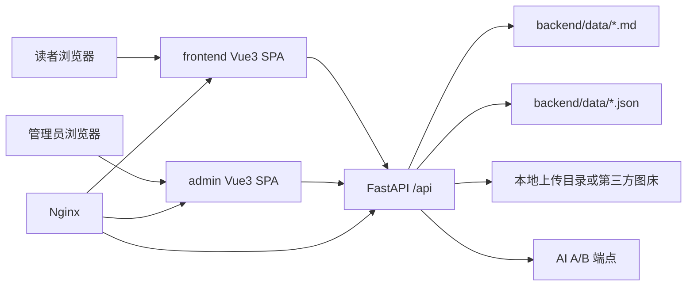

# SRBlogs

SRBlogs 是一个基于 **Vue 3 + Vite + TypeScript + Tailwind CSS + FastAPI** 的个人博客系统，包含两个独立 SPA：

- `frontend/`：面向读者的前端博客展示站点
- `admin/`：Web 后台管理控制台
- `backend/`：统一 RESTful API 服务，负责 Markdown/JSON 数据读写、鉴权、上传、AI 聊天代理

整体设计采用 Glassmorphism / Cyberpunk 视觉语言，前后端分离，适合部署到阿里云轻量应用服务器。

> 当前工程是可运行的完整骨架：包含前台页面、后台页面、FastAPI 路由、JWT 登录、Markdown Front Matter 存储、评论、上传、Nginx/Systemd/一键部署脚本。复杂生产能力如 OSS SDK 深度接入、Webhook 自动部署、完整权限分级已预留接口和配置位。

---

## 目录结构

```text
SRBlogs/
├── frontend/       # 读者端博客 SPA
├── admin/          # 后台管理 SPA
├── backend/        # FastAPI 后端
├── deploy/         # Nginx、Systemd、部署脚本
└── README.md
```

---

## 本地开发

### 1. 后端

```bash
cd backend
python3 -m venv .venv
source .venv/bin/activate
pip install -r requirements.txt
cp .env.example .env
uvicorn app.main:app --reload --host 0.0.0.0 --port 8000
```

默认后台账号：

```text
用户名：admin
密码：change-me
```

请在生产环境修改 `.env` 中的 `ADMIN_PASSWORD` 和 `JWT_SECRET`。

### 2. 前端博客

```bash
cd frontend
npm install
npm run dev
```

默认请求 `/api`。本地开发时可创建 `.env.development`：

```env
VITE_API_BASE_URL=http://127.0.0.1:8000/api
```

### 3. 后台管理

```bash
cd admin
npm install
npm run dev
```

本地开发时同样可设置：

```env
VITE_API_BASE_URL=http://127.0.0.1:8000/api
```

---

## 构建部署

```bash
cd frontend && npm run build
cd ../admin && npm run build
```

构建产物：

- `frontend/dist/` → `/var/www/srblogs-frontend`
- `admin/dist/` → `/var/www/srblogs-admin`

后端使用 Systemd 守护，Nginx 代理 `/api` 到 `127.0.0.1:8000`。

参考：

- `deploy/nginx/srblogs.conf`
- `deploy/systemd/srblogs.service`
- `deploy/setup.sh`

---

## 架构图



---

## 关键 API

### 公开内容

```text
GET /api/posts
GET /api/posts/{slug}
GET /api/moments
GET /api/moments/{slug}
GET /api/chatters
GET /api/chatters/{slug}
GET /api/about
GET /api/friends
GET /api/projects
GET /api/music
GET /api/photos
GET /api/comments/{resource}/{slug}
POST /api/comments/{resource}/{slug}
```

### 后台管理，需 JWT

```text
POST /api/auth/login
POST /api/posts
PUT /api/posts/{slug}
DELETE /api/posts/{slug}
POST /api/moments
PUT /api/moments/{slug}
DELETE /api/moments/{slug}
POST /api/chatters
PUT /api/chatters/{slug}
DELETE /api/chatters/{slug}
PUT /api/about
PUT /api/friends
PUT /api/projects
PUT /api/music
PUT /api/photos
POST /api/upload
POST /api/chat
GET /api/dashboard/stats
```

---

## 内容格式

文章存放在 `backend/data/posts/*.md`，Front Matter 示例：

```yaml
---
title: "标题"
date: "2025-01-01 12:00"
tags: ["标签1"]
draft: false
cover: ""
summary: "文章摘要"
---

正文 Markdown 内容。
```

---

## 安全注意

1. 生产环境必须修改默认账号密码和 JWT Secret。
2. 后台管理建议放在 `/admin` 并启用 HTTPS。
3. 如后台只给自己使用，建议在 Nginx 增加 IP 白名单。
4. 评论和 Markdown 前端使用 DOMPurify 清洗，后端也会对评论字段做基础清洗。
5. 上传接口当前支持本地文件保存；OSS 接入位于 `backend/app/services/upload_service.py`。

---

## 阿里云轻量服务器建议

2 核 2G 能跑这个系统，但不要过度堆功能：

- FastAPI worker 保持 1 个即可
- 前端静态资源交给 Nginx
- 图片尽量走 OSS/CDN，不要全压在 40G SSD 上
- AI 聊天只做 API 转发，不要本机部署大模型


## XH 风格增强版说明

本版本参考 XinghuisamaBlogs 的产品方向做了 Vue3 + FastAPI 版本的重新实现，重点增强：

- 前台：个人资料卡、站点仪表盘、动态背景、弹幕层、萤火虫/樱花装饰、文章横向轮播、云端杂谈卡片、浮动音乐挂件、增强照片墙。
- 后台：更接近控制台的左侧导航、右侧操作暂存区、发布流程提示、强化仪表盘。
- 数据：`backend/data/settings.json` 新增站点配置、背景图、社交链接、弹幕、网易云歌曲 ID 等字段。

注意：这不是对 XinghuisamaBlogs 源码的直接复制，而是在保留 Vue3 + FastAPI 技术栈的前提下，按类似信息架构和视觉方向重写。
